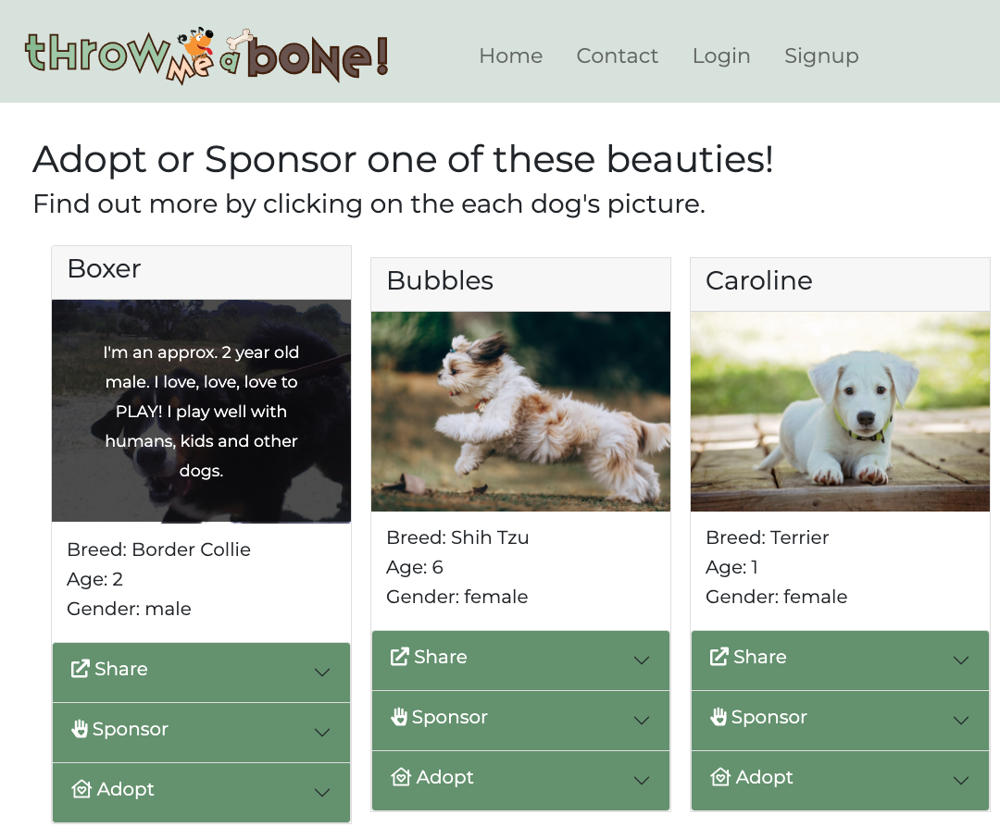
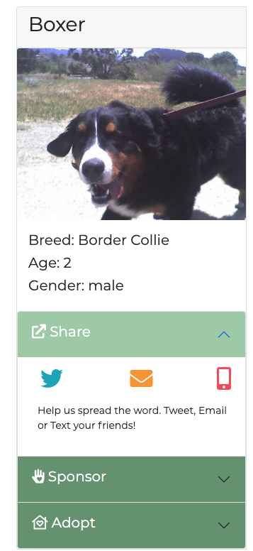
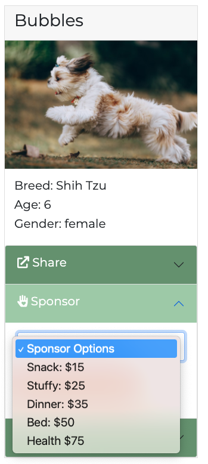
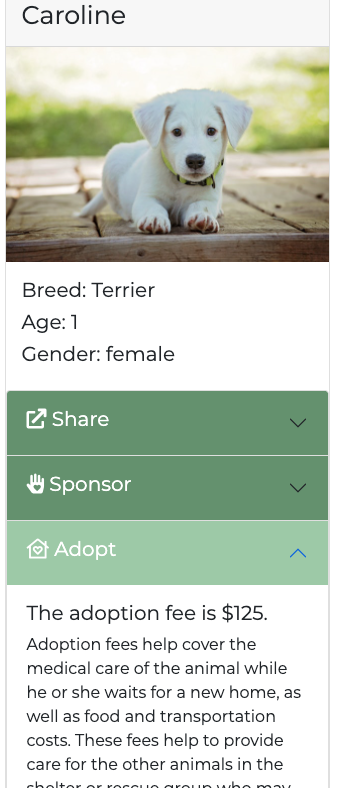

# Throw Me A Bone

## Description
This application supports animal welfare organizations by providing them with a platform to communicate their needs to the animal lovers in the world. The , I want to see the description, location, and reviews of the specific happening. I want to be able to share the information about an event interested in attending. Due to the pandemic, I would also want to see any required or recommended safety protocalls relevant to the event as well.

  ## Table of Contents
  - [User Story](#user)
  - [Installation](#installation)
  - [Technologies](#technologies)
  - [Contributing](#contributing)
  - [Credits](#credits)
  - [License](#license)

## User
User Story
	```md

	There are two user types:
	[1] The animal welfare operator
		As a shelter operator, I WANT an engaging and easy-to-implement platform to encourage animal lovers to support the shelter.

	[2] The end user
		As a USER and animal lover, I WANT an easy way to lend my support whether or not I am ready to adopt.
		I WANT to search for dogs at my favorite shelter
		SO THAT I can either adopt, sponsor or share information about the pet.
	```

## Acceptance Criteria
	```md
		WHEN I load the application
		THEN I am presented with a list of current pets with the options
			[ ] Login/Signup 
			[ ] Card Components with pictures and short description of each pet.
			[ ] Each pet has 3 collapsible buttons:
				[-] Adopt
				[-] Sponsor
				[-] Share

		WHEN I click on the PET picture, it will display more detail;
		THEN I am presented with an more detail about the pet and the buttons are still visible;
		WHEN I click the ADOPT button
		THEN I am presented with more information about adoption fees and a link to adoption form.
			Future Dev includes the adoption form and payment integration with Stripe or other payment processor.
			User must be logged in to add to account and process adoption.


		WHEN I click the SHARE button
		THEN I am presented with a link with pre-populated information
				[-] Twitter - link goes to user's twitter feed with an active link back to the pet
				[-] Email - link opens the user's mail client with a pre-populated subject and body content with an active link back to the pet.
				[-] Text - link opens the user's messaging app with a pre-populated message and an active link back to the pet.

		WHEN I click the SPONSOR button
		THEN I am presented with 
			[] 	Information about Sponsoring a pet and
			[]	Sponsorship options/levels such as:
				[-] Buy me a snack $15
				[-] Buy me a stuffy $25		
				[-] Buy me dinner $35
				
			Future Dev includes dynamic sponsor options (the structure has been built with PRODUCTS model, schema, typedefs and queries).
			Future Dev includes the sponsorship form and payment integration with Stripe or other payment processor.
			User must be logged in to add to account and process sponsorships.

		WHEN I click the CONTACT link
		THEN I am presented with a contact form that is integrated with Formspree for instant contact notification.

		WHEN I click the SIGNUP link
		THEN I am presented with a form to signup as a new user

		WHEN I click the LOGIN link
		THEN I am presented with a form to login to my account and the Navbar only displays the LOGOUT user option.
	```
## Installation

  Once you clone this repository, you will need to follow these steps:
  1. In your terminal type 'npm install'
  2. Connect to your mongo server.
  3. There is also a seeds file that can be run using npm run seed.
  4. To start the app in development, type 'npm run develop' in the terminal.

## Technologies

[1.] Apollo Server with GraphQL queries and mutations to fetch and modify data
[2.] JSON Web Token (JWT) authentication middleware
[3.] MongoDB, Express, React
[4.] Deployed to Heroku with with seeded data using MongoDB Atlas. 

# Links

[Link to the deployed website](https://throw-me-a-bone.herokuapp.com/)

[Link to the code repository](https://github.com/larafoster/throw-me-a-bone)

## Screenshots





 
## Contributing
  - [Lara Foster](https://github.com/larafoster) 
  - [Tommy Eubank](https://github.com/eubanktr) 
  - [Carson Coyle](https://github.com/Coyle555) 
  - [Lorenzo Street](https://github.com/Lorenzoxst) 

## License
 This project is licensed under the MIT License

 [](https://opensource.org/licenses/MIT)  
  
## Questions
  Contact me if you have any questions about this project:

  - [Send me an email](mailto:larafoster.dev@gmail.com)
